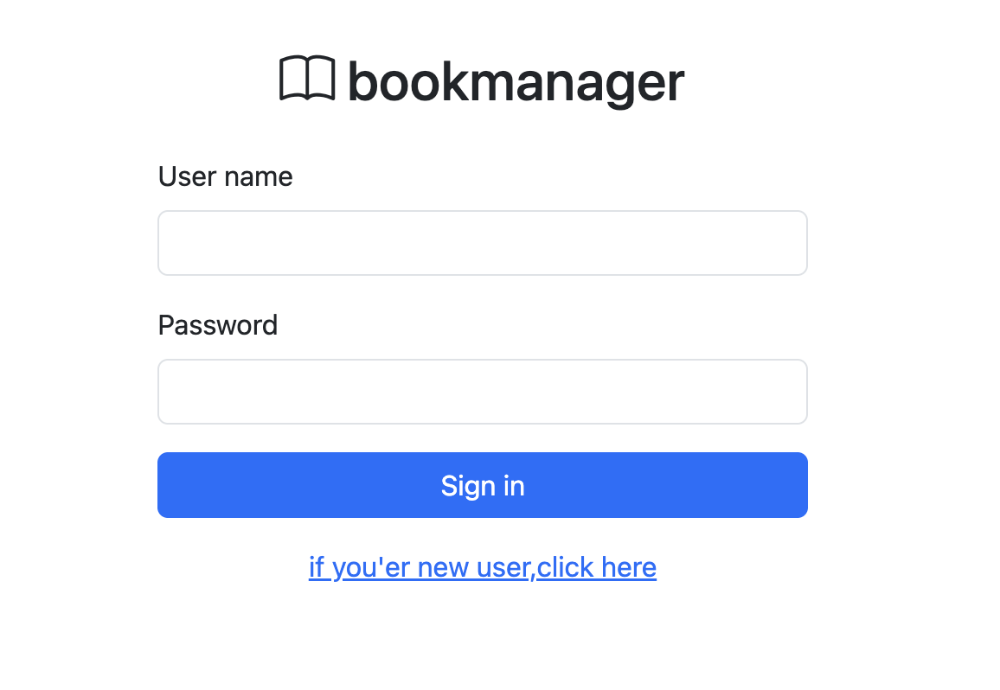
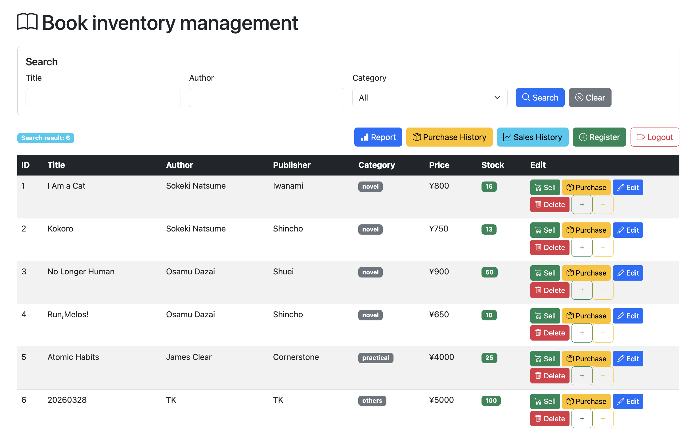
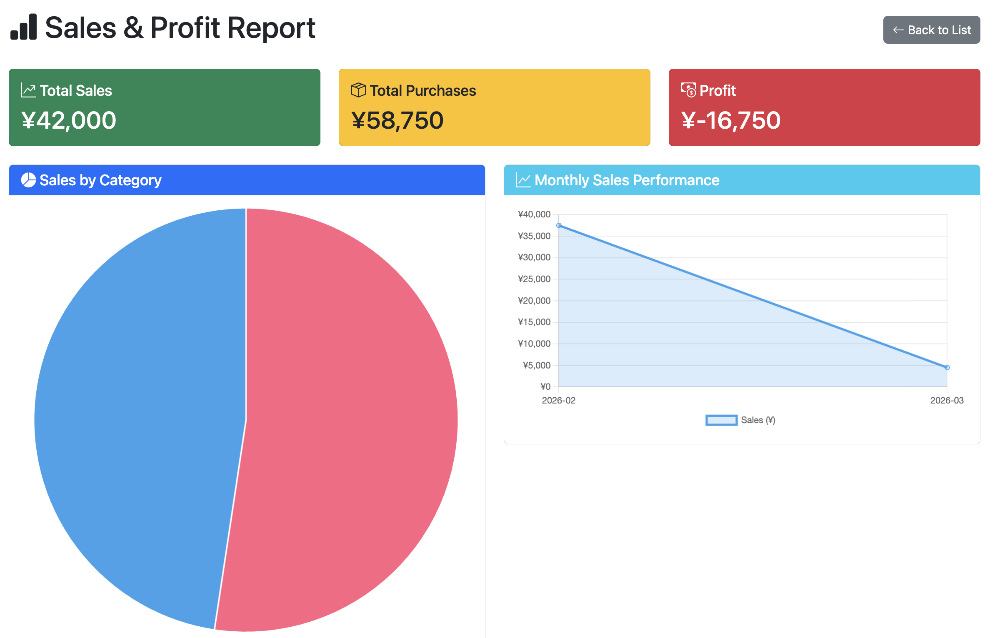

# 📚 Bookstore Management System / 本屋管理システム

A web-based bookstore management application built with Spring Boot.
Spring Bootで構築した書店管理Webアプリケーションです。

---

## 🛠 Tech Stack / 使用技術

| Category | Technology |
|----------|-----------|
| Backend | Java 21, Spring Boot 4.0, Spring Security |
| Frontend | Thymeleaf, Bootstrap 5, Chart.js |
| Database | MySQL 9 |
| ORM | Spring Data JPA / Hibernate |
| Build Tool | Maven |
| Version Control | Git / GitHub |

---

## ✨ Features / 機能一覧

- **Book Management / 本の管理** - Add, edit, and soft-delete books / 本の登録・編集・論理削除
- **Inventory Management / 在庫管理** - Track and update stock levels / 在庫の増減管理
- **Sales Management / 売上管理** - Record and view sales history / 売上の記録・履歴表示
- **Purchase Management / 仕入れ管理** - Record and view purchase history / 仕入れの記録・履歴表示
- **Report / レポート** - Sales graphs by category and monthly trends / カテゴリ別・月別売上グラフ
- **Authentication / 認証** - Login, logout, and user registration / ログイン・ログアウト・ユーザー登録
- **REST API** - JSON endpoints for book CRUD operations / 本のCRUD操作のAPIエンドポイント

---

## 🔌 REST API Endpoints

| Method | URL | Description |
|--------|-----|-------------|
| GET | /api/books | Get all books / 本の一覧取得 |
| GET | /api/books/{id} | Get book by ID / 本の詳細取得 |
| POST | /api/books | Create a book / 本の登録 |
| PUT | /api/books/{id} | Update a book / 本の更新 |
| DELETE | /api/books/{id} | Delete a book / 本の削除 |

---

## 🚀 Getting Started / セットアップ

### Prerequisites / 必要環境
- Java 21
- MySQL 9
- Maven

### Setup / 手順

**1. Clone the repository / リポジトリをクローン**
```bash
git clone https://github.com/tk20260210/bookstore-management.git
cd bookstore-management
```

**2. Create database / データベース作成**
```sql
CREATE DATABASE bookstore;
```

**3. Set environment variables / 環境変数を設定**
```
DB_URL=jdbc:mysql://localhost:3306/bookstore?useSSL=false&serverTimezone=UTC&allowPublicKeyRetrieval=true
DB_USERNAME=your_username
DB_PASSWORD=your_password
```

**4. Run the application / アプリを起動**
```bash
mvn spring-boot:run
```

**5. Access / アクセス**
```
http://localhost:8080
```

---

## 📷 Screenshots / 画面イメージ

**Login / ログイン画面**  


**Book List / 本の一覧画面**  


**Report / レポート画面**  


---

## 👤 Author

- GitHub: [@tk20260210](https://github.com/tk20260210)